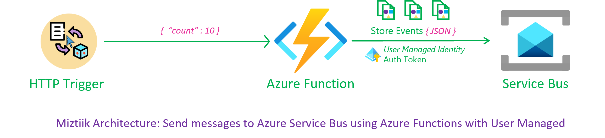
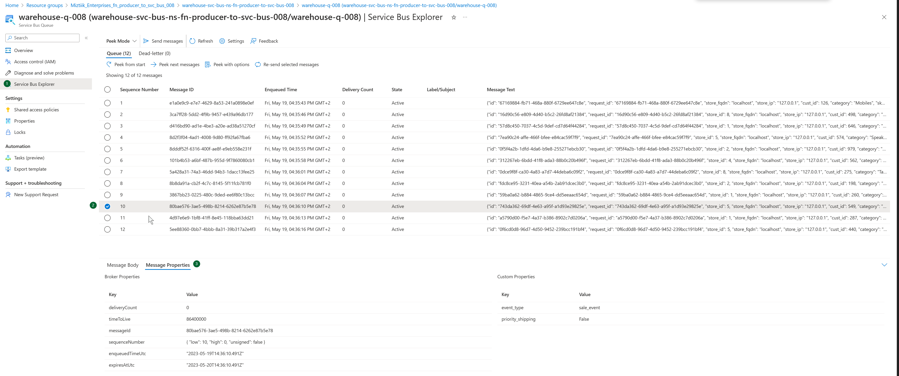

# Orchestrating Events with Azure Service Bus and Azure Functions using Managed Identity

Mystique Unicorn's developers are seeking assistance in implementing event processing for orchestrating events across multiple applications and services using Azure's native capabilities. Can you provide guidance on how to accomplish this?

## 🎯 Solution

We can leverage Azure Service Bus and the Python SDK for orchestrating events. Azure Service Bus provides a reliable messaging platform for event orchestration. In this demo, an Azure Function with a managed identity will produce events and send them to a queue within a specific service bus namespace. The managed identity is exclusively scoped to this service bus namespace. By leveraging the power of Bicep, all necessary resources can be easily provisioned and managed with minimal effort.

**Note**: Azure functions need this `AZURE_CLIENT_ID` environment variable for getting the auth token from AAD, [Thanks to this github issue][10] and this one [here][11] for the solution.

Our function will generate the following event with custom properties and also set the time to live to `1` day.

```json
{
  "id": "743da362-69df-4e63-a95f-a1d93e29825e",
  "request_id": "743da362-69df-4e63-a95f-a1d93e29825e",
  "store_id": 5,
  "store_fqdn": "localhost",
  "store_ip": "127.0.0.1",
  "cust_id": 549,
  "category": "Notebooks",
  "sku": 169008,
  "price": 45.85,
  "qty": 34,
  "discount": 10.3,
  "gift_wrap": true,
  "variant": "red",
  "priority_shipping": false,
  "ts": "2023-05-19T14:36:09.985501",
  "contact_me": "github.com/miztiik",
  "is_return": true
}
```

Message custom properties,

```json
{
   "event_type":"sale_event",
   "priority_shipping":false,
}
```



1. ## 🧰 Prerequisites

   This demo, instructions, scripts and bicep template is designed to be run in `westeurope`. With few or no modifications you can try it out in other regions as well(_Not covered here_).

   - 🛠 Azure CLI Installed & Configured - [Get help here](https://learn.microsoft.com/en-us/cli/azure/install-azure-cli)
   - 🛠 Bicep Installed & Configured - [Get help here](https://learn.microsoft.com/en-us/azure/azure-resource-manager/bicep/install)
   - 🛠 VS Code & Bicep Extenstions - [Get help here](https://learn.microsoft.com/en-us/azure/azure-resource-manager/bicep/install#vs-code-and-bicep-extension)

1. ## ⚙️ Setting up the environment

   - Get the application code

     ```bash
     https://github.com/miztiik/azure-function-producer-to-service-bus
     cd azure-function-producer-to-service-bus
     ```

1. ## 🚀 Prepare the environment

   Ensure you have Azure Cli and bicep working

    ```bash
   # You should have azure cli preinstalled
   bicep --version
   az account show
    ```

1. ## 🚀 Deploying the application

   - **Stack: Main Bicep**
     We will create the following resoureces
     - General purpose Storage Account
        - This will be used by Azure functions to store the function code
     - Servie Bus Namespace
       - Service Bus Queue
     - Managed Identity
        - This will be used by the Azure Function to interact with the service bus
     - Python Azure Function
        - `HTTP` Trigger

      ```bash
      # make deploy
      sh deployment_scripts/deploy.sh
      ```

      After successfully deploying the stack, Check the `Resource Groups/Deployments` section for the resources.

1. ## 🔬 Testing the solution

   - **Trigger the function**

      ```bash
      FUNC_URL="https://fn-producer-**to**-svc-bus-store-backend-fn-app-008.azurewebsites.net/api/store-events-producer-fn"
      curl ${FUNC_URL}?count=5
      ```

      You should see an output like this,

      ```json
      {
         "miztiik_event_processed": true,
         "msg": "Generated 5 messages",
         "resp": {
            "status": true,
            "tot_msgs": 5,
            "bad_msgs": 0,
            "sale_evnts": 3,
            "inventory_evnts": 2,
            "tot_sales": 152.66
         },
         "count": 5,
         "last_processed_on": "2023-05-19T17:17:46.440429"
      }
      ```

      

1. ## 📒 Conclusion

   Here we have demonstrated how to use Azure functions to process send messages to Azure Service Bus.
  
1. ## 🧹 CleanUp

   If you want to destroy all the resources created by the stack, Execute the below command to delete the stack, or _you can delete the stack from console as well_

   - Resources created during [Deploying The Application](#-deploying-the-application)
   - _Any other custom resources, you have created for this demo_

   ```bash
   # Delete from resource group
   az group delete --name Miztiik_Enterprises_xxx --yes
   # Follow any on-screen prompt
   ```

   This is not an exhaustive list, please carry out other necessary steps as maybe applicable to your needs.

## 📌 Who is using this

This repository aims to show how to Bicep to new developers, Solution Architects & Ops Engineers in Azure.


### 💡 Help/Suggestions or 🐛 Bugs

Thank you for your interest in contributing to our project. Whether it is a bug report, new feature, correction, or additional documentation or solutions, we greatly value feedback and contributions from our community. [Start here](/issues)

### 👋 Buy me a coffee

[](https://ko-fi.com/Q5Q41QDGK) Buy me a [coffee ☕][900].

### 📚 References

1. [Azure Docs - Managed Identity][8]
1. [Azure Docs - Managed Identity Caching][9]
1. [Gitub Issue - Default Credential Troubleshooting][10]
1. [Gitub Issue - Default Credential Troubleshooting][11]

[8]: https://learn.microsoft.com/en-us/azure/active-directory/managed-identities-azure-resources/overview
[9]: https://learn.microsoft.com/en-us/azure/app-service/overview-managed-identity?tabs=portal%2Chttp#configure-target-resource
[10]: https://github.com/microsoft/azure-container-apps/issues/442
[11]: https://github.com/microsoft/azure-container-apps/issues/325#issuecomment-1265380377

### 🏷️ Metadata


**Level**: 200

[100]: https://www.udemy.com/course/aws-cloud-security/?referralCode=B7F1B6C78B45ADAF77A9
[101]: https://www.udemy.com/course/aws-cloud-security-proactive-way/?referralCode=71DC542AD4481309A441
[102]: https://www.udemy.com/course/aws-cloud-development-kit-from-beginner-to-professional/?referralCode=E15D7FB64E417C547579
[103]: https://www.udemy.com/course/aws-cloudformation-basics?referralCode=93AD3B1530BC871093D6
[899]: https://www.udemy.com/user/n-kumar/
[900]: https://ko-fi.com/miztiik
[901]: https://ko-fi.com/Q5Q41QDGK