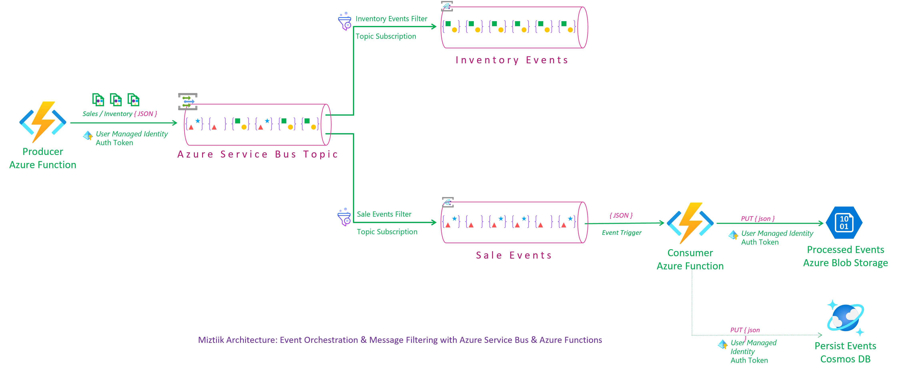
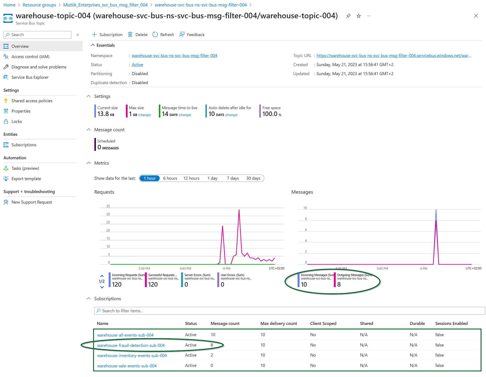
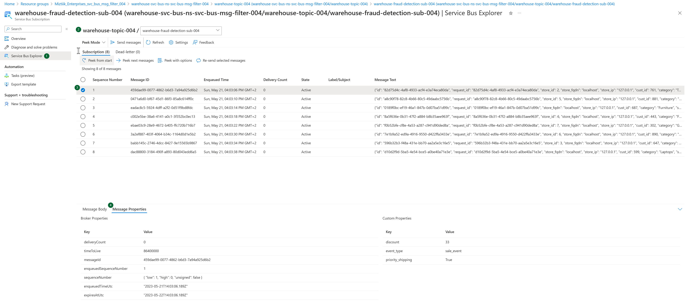
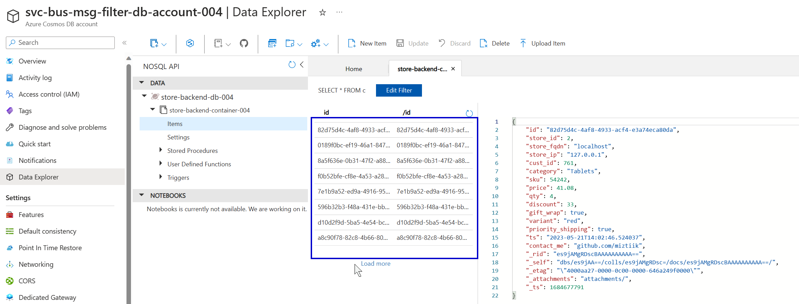
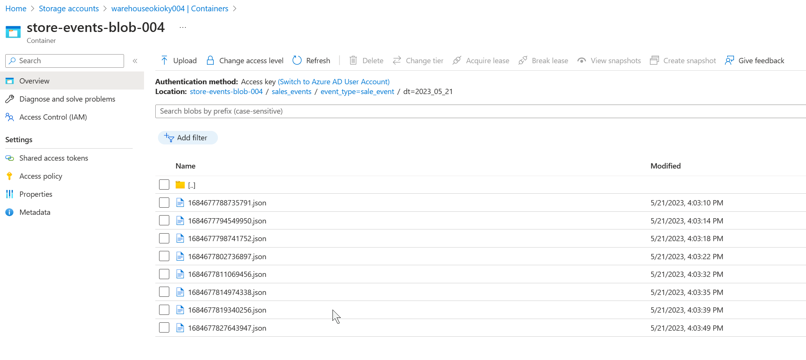

# Orchestrating Events with Azure Service Bus Message Filters and Azure Functions using Managed Identity

Mystique Unicorn's developers are in need of guidance to implement event processing for orchestrating events across multiple applications and services, utilizing Azure's native capabilities. They aim to have the ability to filter specific spends based on certain properties. For instance, they want to filter events that are classified as `sale_event` and have a `discount` greater than `20`. This filtering mechanism would be valuable for analyzing business metrics such as `total_sales` and `total_discounts`, as well as detecting potential fraudulent activity.

```json
{
  "id": "743da362-69df-4e63-a95f-a1d93e29825e",
  "request_id": "743da362-69df-4e63-a95f-a1d93e29825e",
  "store_id": 5,
  "store_fqdn": "localhost",
  "store_ip": "127.0.0.1",
  "cust_id": 549,
  "category": "Notebooks",
  "sku": 169008,
  "price": 45.85,
  "qty": 34,
  "discount": 10.3,
  "gift_wrap": true,
  "variant": "red",
  "priority_shipping": false,
  "ts": "2023-05-19T14:36:09.985501",
  "contact_me": "github.com/miztiik",
  "is_return": true
}
```

Event properties,

```json
{
   "event_type":"sale_event",
   "priority_shipping":false,
   "discount":10
}
```

 Can you provide guidance on how to accomplish this?

## 🎯 Solution

We can utilize the capabilities of Azure Service Bus Topic to [filter messages][1] based on message properties. Currently, there is [no capability to filter messages based on the message body itself][2]. Therefore, any attribute required for filtering needs to be included in the message property.

In this demonstration, an Azure Function with a managed identity will generate events and send them to a topic within a designated service bus namespace. To support the filtering process, `4` subscriptions have been created for this topic.

- `All Events` : Uses the SQL Filter `1=1`
- `Inventory_Events` : Uses the Correlation filter to find events of type `inventory_event`
- `Sale_Events`: Uses the Correlation filter to find events of type `sale_event`
- `Fraud_Events`: Uses the SQL Filter `event_type = 'sale_event' AND discount > 20`

The consumer function utilizes a subscription trigger on the `sale_events` topic to consume events from the topic. It then processes and persists these events to an Azure Storage Account and Cosmos DB. To ensure secure and controlled access to the necessary resources, a scoped managed identity with RBAC (Role-Based Access Control) permissions is employed. Additionally, the trigger connection is authenticated using a managed identity.

By leveraging the capabilities of Bicep, all the required resources can be easily provisioned and managed with minimal effort. Bicep simplifies the process of defining and deploying Azure resources, allowing for efficient resource management.



1. ## 🧰 Prerequisites

   This demo, instructions, scripts and bicep template is designed to be run in `westeurope`. With few or no modifications you can try it out in other regions as well(_Not covered here_).

   - 🛠 Azure CLI Installed & Configured - [Get help here](https://learn.microsoft.com/en-us/cli/azure/install-azure-cli)
   - 🛠 Bicep Installed & Configured - [Get help here](https://learn.microsoft.com/en-us/azure/azure-resource-manager/bicep/install)
   - 🛠 VS Code & Bicep Extenstions - [Get help here](https://learn.microsoft.com/en-us/azure/azure-resource-manager/bicep/install#vs-code-and-bicep-extension)

2. ## ⚙️ Setting up the environment

   - Get the application code

     ```bash
     https://github.com/miztiik/azure-svc-bus-msg-consumer-with-filter
     cd azure-svc-bus-msg-consumer-with-filter
     ```

3. ## 🚀 Prepare the environment

   Ensure you have Azure Cli and bicep working

    ```bash
   # You should have azure cli preinstalled
   bicep --version
   az account show
    ```

4. ## 🚀 Deploying the application

   - **Stack: Main Bicep**
     We will create the following resoureces
     - **Storage Accounts** for storing the events
       - General purpose Storage Account - Used by Azure functions to store the function code
       - `warehouse**` -  Azure Function will store the events here
     - **Servie Bus Namespace**
       - Service Bus Topic, with following subscriptions
         - `All Events`
         - `Inventory_Events`
         - `Sale_Events`
         - `Fraud_Events`
     - **Managed Identity**
        - This will be used by the Azure Function to interact with the service bus
     - **Python Azure Function**
        - **Producer**: `HTTP` Trigger. Customized to send `count` number of events to the service bus, using parameters passed in the query string. `count` defaults to `10`
        - **Consumer**: `Service Bus Topic Subscription` Trigger. The trigger uses managed identity to authenticate to the service bus.
     - **Cosmos DB**
        - This will be used by the Azure Function to store the events

      ```bash
      # make deploy
      sh deployment_scripts/deploy.sh
      ```

      After successfully deploying the stack, Check the `Resource Groups/Deployments` section for the resources.

5. ## 🔬 Testing the solution

   - **Trigger the function**

      ```bash
      FUNC_URL="https://svc-bus-msg-filter-store-backend-fn-app-004.azurewebsites.net/api/store-events-producer-fn"
      curl ${FUNC_URL}?count=10
      ```

      You should see an output like this,

      ```json
         {
         "miztiik_event_processed": true,
         "msg": "Generated 10 messages",
         "resp": {
            "status": true,
            "tot_msgs": 10,
            "bad_msgs": 2,
            "sale_evnts": 8,
            "inventory_evnts": 2,
            "tot_sales": 507.57
         },
         "count": 10,
         "last_processed_on": "2023-05-21T14:03:45.505416"
         }

      ```

      Our function has produced `10` messages with `8` of them were `sale_events` and `2` of them were `inventory_events`. We can find the same being processed by `sale_events` and `inventory_events` subscriptions. Likewise, we see `8` records in blob and cosmos.

      
      
      
      

6. ## 📒 Conclusion

   In this demonstration, we have showcased the utilization of Azure Functions to send messages to Azure Service Bus and leverage message filters to perform actions on specific messages. This approach allows for efficient message processing and enables targeted handling based on specific criteria.
  
7. ## 🧹 CleanUp

   If you want to destroy all the resources created by the stack, Execute the below command to delete the stack, or _you can delete the stack from console as well_

   - Resources created during [Deploying The Application](#-deploying-the-application)
   - _Any other custom resources, you have created for this demo_

   ```bash
   # Delete from resource group
   az group delete --name Miztiik_Enterprises_xxx --yes
   # Follow any on-screen prompt
   ```

   This is not an exhaustive list, please carry out other necessary steps as maybe applicable to your needs.

## 📌 Who is using this

This repository aims to show how to Bicep to new developers, Solution Architects & Ops Engineers in Azure.


### 💡 Help/Suggestions or 🐛 Bugs

Thank you for your interest in contributing to our project. Whether it is a bug report, new feature, correction, or additional documentation or solutions, we greatly value feedback and contributions from our community. [Start here](/issues)

### 👋 Buy me a coffee

[](https://ko-fi.com/Q5Q41QDGK) Buy me a [coffee ☕][900].

### 📚 References

1. [Azure Docs - Service Bus Topic Filters][1]
1. [Azure Docs - Service Bus Topic Filter Limitations][2]
1. [Azure Docs - Managed Identity][8]
1. [Azure Docs - Managed Identity Caching][9]
1. [Gitub Issue - Default Credential Troubleshooting][10]
1. [Gitub Issue - Default Credential Troubleshooting][11]

[1]: https://learn.microsoft.com/en-us/azure/service-bus-messaging/topic-filters
[2]: https://learn.microsoft.com/en-us/azure/service-bus-messaging/topic-filters#usage-patterns
[8]: https://learn.microsoft.com/en-us/azure/active-directory/managed-identities-azure-resources/overview
[9]: https://learn.microsoft.com/en-us/azure/app-service/overview-managed-identity?tabs=portal%2Chttp#configure-target-resource
[10]: https://github.com/microsoft/azure-container-apps/issues/442
[11]: https://github.com/microsoft/azure-container-apps/issues/325#issuecomment-1265380377

### 🏷️ Metadata


**Level**: 200

[100]: https://www.udemy.com/course/aws-cloud-security/?referralCode=B7F1B6C78B45ADAF77A9
[101]: https://www.udemy.com/course/aws-cloud-security-proactive-way/?referralCode=71DC542AD4481309A441
[102]: https://www.udemy.com/course/aws-cloud-development-kit-from-beginner-to-professional/?referralCode=E15D7FB64E417C547579
[103]: https://www.udemy.com/course/aws-cloudformation-basics?referralCode=93AD3B1530BC871093D6
[899]: https://www.udemy.com/user/n-kumar/
[900]: https://ko-fi.com/miztiik
[901]: https://ko-fi.com/Q5Q41QDGK